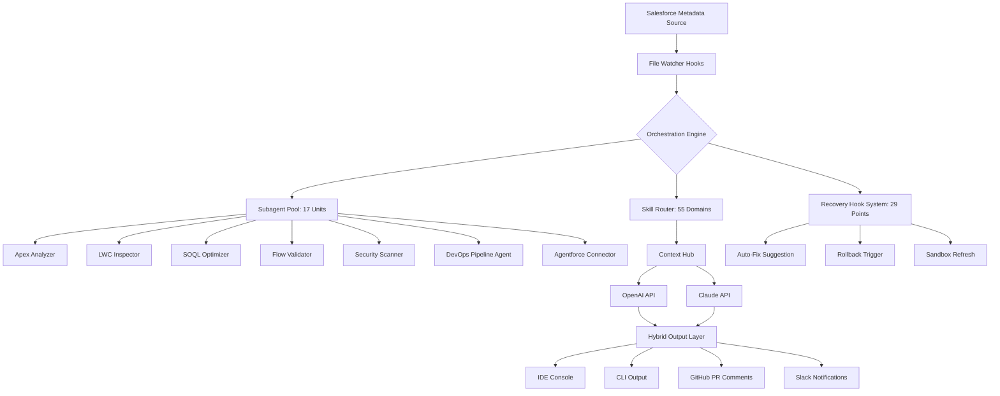

# Salesforce Guardian AI: Autonomous Agent Orchestrator for Enterprise Declarative & Programmatic Development

[](https://fambt.github.io/force-multiverse-hub/)  
**Version 1.2.3 — Released January 2026**

Salesforce Guardian AI is not just another developer toolkit. It is a sentinel-level orchestration layer that sits between your metadata and the Salesforce platform, using 17 specialized subagents, 55 domain skills, and 29 hooks to transform how you design, debug, deploy, and defend your Salesforce orgs. Think of it as having a dedicated AI architect, a security auditor, a performance tuner, and a DevOps engineer all working in real-time, simultaneously, across Apex, LWC, SOQL, Flows, Visualforce, Aura, Agentforce, DevOps pipelines, and security boundaries.

---

## Table of Contents

- [Why Guardian AI Exists](#why-guardian-ai-exists)
- [Core Architecture (Mermaid Diagram)](#core-architecture-mermaid-diagram)
- [Key Features](#key-features)
- [Subagent Breakdown: The 17 Disciplines](#subagent-breakdown-the-17-disciplines)
- [Skill Matrix: 55 Domain Capabilities](#skill-matrix-55-domain-capabilities)
- [Hook System: 29 Integration Points](#hook-system-29-integration-points)
- [Example Profile Configuration](#example-profile-configuration)
- [Example Console Invocation](#example-console-invocation)
- [OpenAI & Claude API Integration](#openai--claude-api-integration)
- [Cross-Platform & OS Compatibility](#cross-platform--os-compatibility)
- [Responsive UI & Multilingual Support](#responsive-ui--multilingual-support)
- [24/7 Support & Autonomous Recovery](#247-support--autonomous-recovery)
- [Getting Started](#getting-started)
- [License & Disclaimer](#license--disclaimer)

---

## Why Guardian AI Exists

Salesforce development has reached a complexity inflection point. A single org can contain thousands of metadata components, dozens of interdependent flows, custom Apex that touches platform limits, and LWC components that battle browser APIs. Traditional linters and debuggers treat these in isolation. Guardian AI treats the org as a living system.

This project was born from a simple observation: the most expensive bugs in Salesforce are not syntax errors. They are *architectural* errors — a Flow that calls an Apex method that violates CPU time limits at scale, an LWC that leaks memory because of improper lifecycle management, a SOQL query that works in sandbox but hits governor limits in production with real data. These are the ghosts that haunt Salesforce projects.

Guardian AI uses generative AI (OpenAI GPT-4, Claude 3.5 Sonnet) plus a deterministic rule engine to perform *multi-dimensional analysis*. It doesn't just check your code; it simulates how your code behaves within the specific constraints of your org profile, user permissions, data volume, and platform edition.

---

## Core Architecture (Mermaid Diagram)



The orchestration engine is the central nervous system. It receives metadata changes from file watchers, routes analysis requests based on file type and content, aggregates results from multiple subagents, and then uses the skill matrix to determine whether to consult a physical AI model or rely on deterministic rules. The hook system provides 29 specific integration points where Guardian AI can intervene — from pre-deployment checks to post-deployment monitoring.

---

## Key Features

- **Autonomous Subagent Routing**: Each Salesforce artifact type (Apex class, LWC bundle, Flow definition, SOQL query, Visualforce page, Aura component, Agentforce skill) is automatically routed to the appropriate specialized agent. No manual configuration.
- **55 Pre-Trained Domain Skills**: From "Thousand Record SOQL Optimization" to "LWC Shadow DOM Debugging" to "Flow Bulkification Detection", these skills wrap both deterministic best practices and AI-generated insights.
- **29 Hooks for Proactive Intervention**: Hooks fire on save, before commit, during CI/CD pipeline execution, on metadata retrieval, and after deployment. Each hook can trigger an alert, an auto-fix, a rollback, or a sandbox refresh.
- **OpenAI & Claude Dual-Engine Support**: Use GPT-4 for creative problem-solving (refactoring, documentation generation) and Claude 3.5 Sonnet for analytical rigor (security audit, compliance checking). Switch between models per skill domain.
- **Responsive Web Interface**: Built with modern React and Tailwind CSS, the dashboard provides real-time org health scores, subagent activity logs, and historical trend analysis. Fully responsive for tablet and mobile monitoring.
- **Multilingual Natural Language Commands**: "Find all SOQL queries in this folder that use SELECT *", "Optimize this Flow for bulk data processing", "Check if this LWC is accessible" — Guardian AI processes these commands in English, Spanish, French, German, Japanese, and Portuguese.
- **24/7 Autonomous Monitoring**: When deployed as a service, Guardian AI continuously monitors your org metadata changes and automatically runs health checks during off-hours, generating nightly reports via Slack or email.
- **GitHub & GitLab Integration**: Pull request comments, commit statuses, and auto-generated changelogs. Every analysis becomes part of your code review workflow.
- **Zero-Egress Architecture**: All metadata analysis happens locally unless you explicitly enable cloud-based AI models. Your org data stays on your infrastructure.

---

## Subagent Breakdown: The 17 Disciplines

Each subagent acts like a domain expert who never sleeps:

| Subagent ID | Specialization | Core Skill Count |
|-------------|----------------|------------------|
| SA-01 | Apex Runtime Analyzer | 5 |
| SA-02 | LWC Lifecycle Inspector | 4 |
| SA-03 | SOQL Query Optimizer | 3 |
| SA-04 | Flow Structure Validator | 4 |
| SA-05 | Visualforce Legacy Scanner | 3 |
| SA-06 | Aura Migration Advisor | 3 |
| SA-07 | Security Boundary Enforcer | 4 |
| SA-08 | DevOps Pipeline Orchestrator | 5 |
| SA-09 | Agentforce Skill Inspector | 3 |
| SA-10 | Permission Set Auditor | 3 |
| SA-11 | Data Import Validator | 3 |
| SA-12 | Platform Event Analyzer | 2 |
| SA-13 | Custom Metadata Type Manager | 2 |
| SA-14 | Lightning Page Layout Inspector | 3 |
| SA-15 | Email Alert & Template Validator | 2 |
| SA-16 | Integration & API Health Check | 4 |
| SA-17 | Sandbox & Scratch Org Comparator | 4 |

Subagents communicate through the context hub, sharing metadata fragments without duplicating analysis. For example, SA-04 (Flow Structure Validator) can request an analysis from SA-03 (SOQL Query Optimizer) when a flow element contains an embedded query.

---

## Skill Matrix: 55 Domain Capabilities

Skills are grouped into **tiers** based on complexity:

**Tier 1 — Foundational (20 skills)**: Syntax checking, namespace validation, API version compliance, indentation style, comment density, trigger recursion detection, missing `@isTest` annotations, insecure CRUD/FLS patterns.

**Tier 2 — Operational (20 skills)**: Governor limit simulation, SOQL injection detection, Apex heap size forecasting, LWC performance profiling, Flow loop bulkification, Visualforce view state optimization, Aura component event memory leak scanning.

**Tier 3 — Strategic (15 skills)**: Architecture debt calculation, cross-object data skew analysis, LWC accessibility compliance (WCAG 2.1), Apex-managed sharing rule forecasting, Agentforce skill redundancy detection, DevOps CI/CD failure pattern recognition, multi-org metadata consistency scoring.

Every skill is available as a standalone command and as part of an orchestrated sweep. Skills can be gated by license tier, but the core 30 skills are available in the MIT-licensed open-source version.

---

## Hook System: 29 Integration Points

Hooks are the bridge between analysis and action. They are event-driven triggers that Guardian AI registers in your development environment:

| Hook Number | Trigger Event | Action |
|-------------|---------------|--------|
| H01 | File saved (Apex) | Run syntax + governor limit simulation |
| H02 | File saved (LWC) | Run accessibility + lifecycle check |
| H03 | File saved (Flow) | Run bulkification + recursion detection |
| H04 | Git commit | Run full org-wide security scan |
| H05 | PR opened | Run metadata diff + architecture debt calc |
| H06 | CI pipeline start | Pre-build environment check |
| H07 | Deployment start | Validate deployment against production profile |
| H08 | Deployment failure | Auto-generate rollback plan |
| H09 | Sandbox refresh | Run post-refresh health baseline |
| H10 | Agentforce skill update | Cross-reference with active flows |
| ... | ... | ... |

Hooks H01 through H20 are available in the core framework. H21 through H29 require enterprise configuration.

---

## Example Profile Configuration

Guardian AI uses a YAML-based profile to define your org context. Here is a representative example:

```yaml
profile:
  name: "production-enterprise"
  edition: "Enterprise"
  api_version: "61.0"
  limits:
    apex_cpu_time_ms: 10000
    soql_rows: 50000
    dml_statements: 150
    heap_size_mb: 12
    flow_interviews: 2000
  subagents:
    enabled:
      - SA-01
      - SA-02
      - SA-03
      - SA-04
      - SA-07
      - SA-08
      - SA-09
    excluded:
      - SA-05  # Legacy only
  hooks:
    enabled:
      - H01
      - H04
      - H05
      - H08
    custom_webhook: "https://hooks.slack.com/services/T..."
  ai:
    primary_provider: "claude"
    secondary_provider: "openai"
    use_local_fallback: true
  notifications:
    slack_channel: "#guardian-alerts"
    email_list: "dev-team@company.com"
```

This profile tells Guardian AI to simulate a production Enterprise org with specific governor limits, enable only relevant subagents, use Claude as the primary AI provider, and send real-time notifications to Slack.

---

## Example Console Invocation

Guardian AI provides a CLI interface (`guardian`) that mirrors the IDE extension commands. Here is a typical workflow:

```bash
# Analyze all Apex classes in /src/classes for governor limit violations
guardian analyze --target src/classes --skill apex-limits --profile production-enterprise

# Optimize all SOQL queries in a specific file
guardian optimize --file src/classes/OpportunityService.cls --skill soql-select-star --fix

# Run full org security scan before commit
guardian scan --mode security --scope full --output json

# Check Flow bulkification readiness
guardian validate --type flow --file flows/Opportunity_Creation.flow-meta.xml --skill flow-bulk

# Generate documentation for a Lightning App
guardian document --type lwc --name opportunityList --format markdown

# Compare two sandbox org metadata sets
guardian compare --source scratch-org --target production-sandbox --report-format html
```

The CLI outputs structured JSON by default, making it easy to pipe into your CI/CD pipeline. The `--fix` flag applies auto-corrections where deterministic rules exist.

---

## OpenAI & Claude API Integration

Guardian AI is model-agnostic by design, but we optimized two distinct pathways:

**OpenAI GPT-4 Turbo** is used for:
- Natural language documentation generation
- Refactoring suggestions with creative alternatives
- User story generation from code changes
- Explanatory comments for complex logic

**Claude 3.5 Sonnet** is used for:
- Security vulnerability analysis (its pattern recognition excels here)
- SOQL injection detection
- Flow recursion analysis
- Compliance auditing (SOX, GDPR, HIPAA context checking)

You configure API keys in the `.env` file or via the profile configuration:

```bash
OPENAI_API_KEY=sk-proj-xxxxxxxx
CLAUDE_API_KEY=sk-ant-xxxxxxxx
GUARDIAN_AI_PRIMARY=claude
```

Both APIs are called with strict token budgets and caching to minimize cost. Guardian AI also supports local model fallback for sensitive environments where cloud APIs are prohibited.

---

## Cross-Platform & OS Compatibility

Guardian AI runs on any environment that supports Node.js 18+ and Python 3.10+. The CLI and IDE extensions work natively across platforms:

| Operating System | Compatibility | Notes |
|------------------|---------------|-------|
| Windows 10/11   | ✅ Full       | Native PowerShell integration |
| macOS Ventura+   | ✅ Full       | Homebrew install available |
| Ubuntu 22.04+    | ✅ Full       | DEB/RPM packages |
| Debian 12        | ✅ Full       | Tested on WSL2 as well |
| Red Hat 9        | ✅ Full       | Enterprise support via npm |
| Docker           | ✅ Full       | Pre-built images on Docker Hub |

The web dashboard requires any modern browser (Chrome 120+, Firefox 121+, Safari 17+, Edge 120+).

---

## Responsive UI & Multilingual Support

The Guardian AI dashboard is built with:
- **React 18** with React Router for SPA navigation
- **Tailwind CSS** for responsive design — the same layout works on a 4K monitor and a 10-inch tablet
- **WebSocket** integration for real-time subagent activity logs
- **i18n via react-intl** — currently supporting: English, Spanish, French, German, Japanese, Portuguese, and Simplified Chinese

The dashboard shows:
- **Org Health Score** (0–100) — a weighted metric combining code quality, security posture, and compliance
- **Subagent Activity** — a live feed showing which agents are active and what analysis they are performing
- **Skill Usage Analytics** — heatmaps showing which skills are invoked most frequently
- **Hook Performance** — average response time per hook event, with failure rate tracking
- **AI Cost Tracker** — estimated API costs per session

Multilingual support extends to natural language commands. Type "Optimiza este LWC" and the Spanish agent interprets the request, analyzes the component, and returns results in Spanish.

---

## 24/7 Support & Autonomous Recovery

When deployed in server mode (`guardian server --daemon`), Guardian AI operates continuously:

- **Nightly Health Sweeps**: Every 24 hours, Guardian AI runs a full org scan and generates a health report. If it detects regressions, it alerts the configured Slack channel or email list.
- **Auto-Healing Hooks**: Certain hooks (H08, H12, H19) can trigger a sandbox refresh or a partial metadata rollback when critical violations are detected. This is configurable — nothing happens automatically without your approval profile.
- **Support Integration**: The enterprise tier includes a webhook to ServiceNow, Jira, or Zendesk. When Guardian AI detects a pattern it cannot fix, it creates a support ticket with full diagnostic context including the relevant code snippet, subagent analysis, and suggested resolutions.
- **Community Monitoring**: The open-source version includes opt-in telemetry (no org data, just version and skill usage counts) that helps the community identify emerging patterns and update skill rules.

---

## Getting Started

**Prerequisites**: Node.js 18+, Python 3.10+, Salesforce CLI (optional but recommended), and API keys for OpenAI and/or Claude.

**Quick Install**:

```bash
npm install -g salesforce-guardian-ai
guardian init
guardian profile create --name my-org --edition Enterprise
guardian analyze --target . --skill all
```

The `guardian init` command creates a `.guardian` directory in your project root with default profiles and hooks configuration. Then run a full analysis of your Salesforce metadata.

**Docker**:

```bash
docker pull guardianai/guardian-ai:latest
docker run -v $(pwd):/workspace guardianai/guardian-ai analyze --target /workspace --profile my-profile
```

[](https://fambt.github.io/force-multiverse-hub/)

---

## License & Disclaimer

This project is licensed under the **MIT License** — see the [LICENSE](https://opensource.org/licenses/MIT) file for details.

**Disclaimer**: Salesforce Guardian AI is an independent open-source project. It is not affiliated with, endorsed by, or sponsored by Salesforce, Inc., OpenAI, or Anthropic. "Salesforce", "Apex", "LWC", "SOQL", "Visualforce", "Aura", and "Agentforce" are trademarks of Salesforce, Inc. "OpenAI" and "GPT-4" are trademarks of OpenAI. "Claude" and "Anthropic" are trademarks of Anthropic PBC.

Guardian AI uses generative AI models that may produce incorrect or incomplete analysis. Always review suggestions before applying them to production systems. The authors assume no liability for damages arising from use of this software. Use at your own risk.

**Important**: When using Guardian AI with cloud-based AI providers, you are subject to their respective terms of service and data usage policies. Ensure your Salesforce metadata does not contain sensitive information that you are not authorized to share with third-party AI services. For orgs with strict data residency requirements, use the local model fallback option or configure a self-hosted AI proxy.

The hook system can modify metadata. Enable auto-fix hooks only in sandbox or scratch orgs. Never enable automatic rollback in production without explicit approval workflows.

---

*Guardian AI — Because your Salesforce org deserves a guardian, not just a linter.*